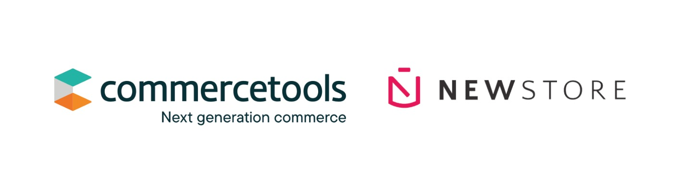

# commercetools NewStore connector



## Overview
This connector syncs commercetools and NewStore data. Supports 1 commercetools project and 1 NewStore shop.

### Inventory / Stock
NewStore inventory will be synced into commercetools periodically.
- The sync period can be configured in connect.yaml file (by default its set to run every 5 minutes).
- commercetools and NewStore products are matched based on `sku`.
- NewStore [ATP](https://docs.newstore.net/product/glossary/#glossary-ATP) is used to set commercetools's [available quantity](https://docs.commercetools.com/api/projects/inventory).
- Inventory is aggregate, not store/location specific.
- Inventory in commercetools is created without any associated channel.
- To support a large catalog please look into implementing mechanisms such as batch/concurrent to process more records in parallel.


### Orders
commercetools orders will be synced into NewStore.
- A subscription is created in commercetools listening to “[Order Created](https://docs.commercetools.com/api/projects/messages#order-created)” [messages](https://docs.commercetools.com/api/projects/messages). Each time an order is created in commercetools, it will be imported to NewStore, using the [Order Injection API](https://docs.newstore.net/api/integration/order-management/order_injection_api/).
- Shipping options: by default, commercetools shipping method's `key`s are used as NewStore's `service_level_identifier`s. You can customize this in the `event/src/utils/new-store.utils.ts` file.
- Payments: you will need to customize the `castToNewStorePayment` function in the `event/src/utils/new-store.utils.ts` file to correctly map commercetools and NewStore payments, based on the PSPs (payment service provider) that you have configured. For more information see "[Integrating a payment service provider](https://docs.newstore.net/developers/guides/payments/psp/)".

## Pre-requisites
- commercetools Account
- [commercetools API keys](https://docs.commercetools.com/getting-started/create-api-client) (“Admin client”)
- NewStore Account with admin permissions (username and password)
- commercetools products data should have been imported into NewStore
- commercetools products must have `sku`s and they should match NewStore's `product_id`
- commercetools's shipping method `key`s should match NewStore's `service_level_identifier`s


## Installing the connector

In order to install the connector in your commercetools project, you'll need to deploy it. Refer to the the [commercetools connect deployment documentation](https://docs.commercetools.com/connect/concepts#deployments).

Setup the required environment variables when you [create the deployment](https://docs.commercetools.com/connect/getting-started#create-a-deployment):
- `CTP_CLIENT_ID`
- `CTP_CLIENT_SECRET`
- `CTP_PROJECT_KEY`
- `CTP_SCOPE`
- `CTP_REGION`
- `NEW_STORE_BASE_URL`
- `NEW_STORE_USERNAME`
- `NEW_STORE_PASSWORD`
- `NEW_STORE_SHOP`

### Deployment Request
```bash
curl --location 'https://connect.{region}.commercetools.com/{projectKey}/deployments' \
--header 'Authorization: Bearer ${BEARER_TOKEN}' \
--header 'Content-Type: application/json' \
--data-raw '{
    "key": "deployment-key",
    "connector": {
        "key": "{connectorKey}",
        "version": {connectorVersion}
    },
    "region": "{region}",
    "configurations": [
        {
            "applicationName": "job",
            "standardConfiguration": [
                {
                    "key": "CTP_REGION",
                    "value": "{region}"
                }
            ],
            "securedConfiguration": [
                {
                    "key": "CTP_PROJECT_KEY",
                    "value": "{CTP_PROJECT_KEY}"
                },
                {
                    "key": "CTP_CLIENT_ID",
                    "value": "{CTP_CLIENT_ID}"
                },
                {
                    "key": "CTP_CLIENT_SECRET",
                    "value": "{CTP_CLIENT_SECRET}"
                },
                {
                    "key": "CTP_SCOPE",
                    "value": "{CTP_SCOPE}"
                },
                {
                    "key": "NEW_STORE_BASE_URL",
                    "value": "{NEW_STORE_BASE_URL}"
                },
                {
                    "key": "NEW_STORE_USERNAME",
                    "value": "{NEW_STORE_USERNAME}"
                },
                {
                    "key": "NEW_STORE_PASSWORD",
                    "value": "{NEW_STORE_PASSWORD}"
                },
                {
                    "key": "NEW_STORE_SHOP",
                    "value": "{NEW_STORE_SHOP}"
                }
            ]
        },
        {
            "applicationName": "event",
            "standardConfiguration": [
                {
                    "key": "CTP_REGION",
                    "value": "{region}"
                }
            ],
            "securedConfiguration": [
                {
                    "key": "CTP_PROJECT_KEY",
                    "value": "{CTP_PROJECT_KEY}"
                },
                {
                    "key": "CTP_CLIENT_ID",
                    "value": "{CTP_CLIENT_ID}"
                },
                {
                    "key": "CTP_CLIENT_SECRET",
                    "value": "{CTP_CLIENT_SECRET}"
                },
                {
                    "key": "CTP_SCOPE",
                    "value": "{CTP_SCOPE}"
                },
                {
                    "key": "NEW_STORE_BASE_URL",
                    "value": "{NEW_STORE_BASE_URL}"
                },
                {
                    "key": "NEW_STORE_USERNAME",
                    "value": "{NEW_STORE_USERNAME}"
                },
                {
                    "key": "NEW_STORE_PASSWORD",
                    "value": "{NEW_STORE_PASSWORD}"
                },
                {
                    "key": "NEW_STORE_SHOP",
                    "value": "{NEW_STORE_SHOP}"
                }
            ]
        }
    ]
}'
```

Once the connector is deployed, it should trigger the [`postDeploy` script](https://docs.commercetools.com/connect/convert-existing-integration#postdeploy).

The `postDeploy` script will create a subscription listening to “[Order Created](https://docs.commercetools.com/api/projects/messages#order-created)” [messages](https://docs.commercetools.com/api/projects/messages). Each time an order is created in commercetools, it will be imported to NewStore, using the [Order Injection API](https://docs.newstore.net/api/integration/order-management/order_injection_api/).

You can verify if subscription was succcessfully created by running the following request and checking that there is one with the `newStore-ordersSyncSubscription` key:
```bash
curl --location 'https://api.{region}.commercetools.com/{projectKey}/subscriptions' \
--header 'Authorization: Bearer ${BEARER_TOKEN}' \
```


## Uninstalling the connector
In order to uninstall the connector, you’ll need to [send the appropriate HTTP request and delete it](https://docs.commercetools.com/connect/deployments#delete-deployment).

### Undeploy Request
```bash
curl --location --request DELETE 'https://connect.{region}.commercetools.com/{projectKey}/deployments/{deploymentId}' \
--header 'Authorization: Bearer ${BEARER_TOKEN}' \
```

This will trigger the [`preUndeploy` script](https://docs.commercetools.com/connect/convert-existing-integration#preundeploy) which will delete the messages subscription described on the “Installing the connector” section.
